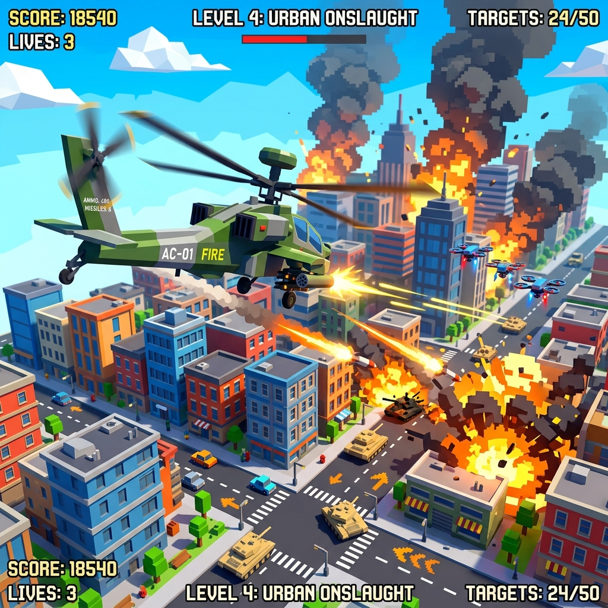

# Heli-Strike Arcade Assault



A 3D low-poly arcade helicopter game built with React, Vite, Three.js, and Cannon-es.

## Features
- **Intense 3D Action**: Fly a military helicopter over procedurally generated cities, deserts, and forests.
- **Multiple Weapons**: Switch between Machine Guns, Missiles, Rockets, and Shotguns to obliterate your enemies.
- **Dynamic AI**: Face off against drones, tanks, shooters, and boss enemies that actively track and attack you.
- **Weather & Physics**: Experience thunderstorms, rain, and realistic rigid-body physics for explosive combat.

## How to Run Locally

**Prerequisites:** Node.js v20+

1. Install dependencies:
   ```bash
   npm install
   ```
2. Start the development server:
   ```bash
   npm run dev
   ```

## Controls
- **W, A, S, D / Arrows**: Move Helicopter
- **Mouse**: Aim crosshair
- **Left Click**: Fire weapons
- **1, 2, 3, 4**: Switch weapons (Machine Gun, Missile, Rocket, Shotgun)
- **R**: Reload
